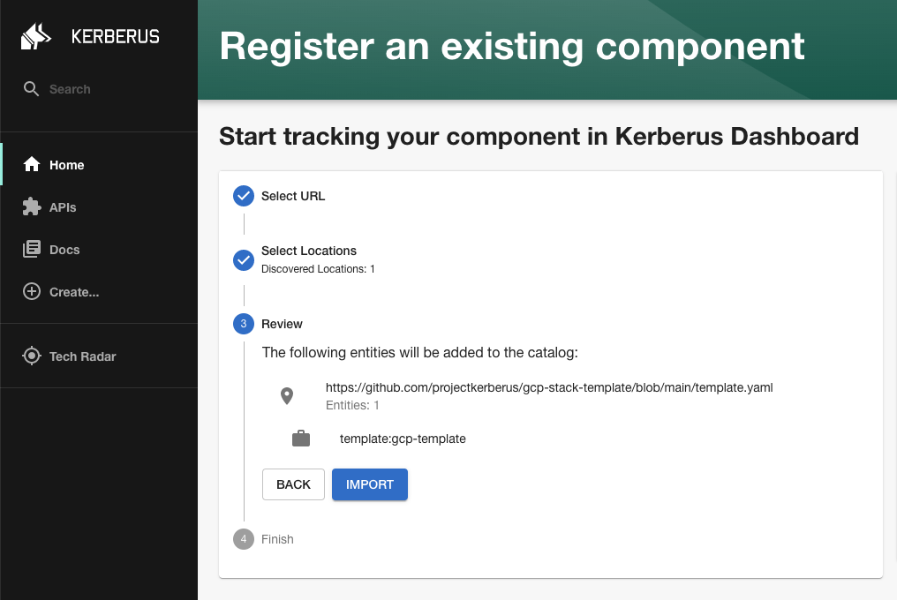
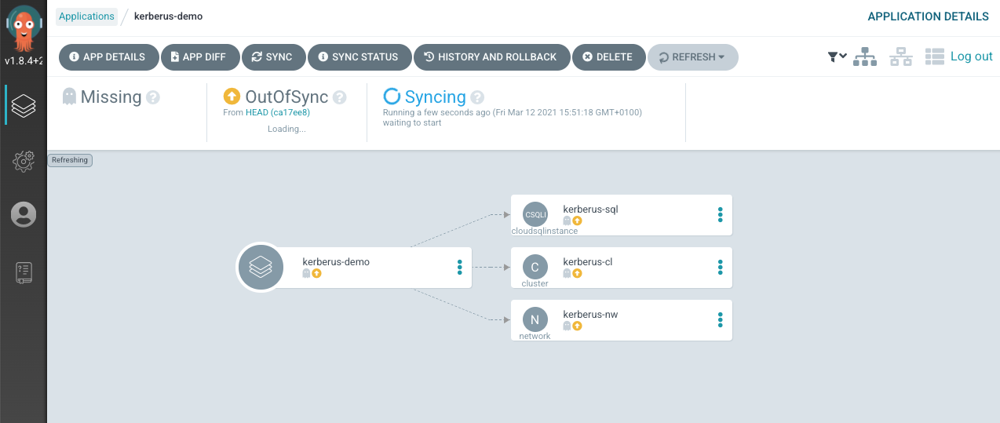

# Tutorial

## Introduction

This tutorial demonstrates the basic steps to install and configure the `Krateo Dashboard` that provides a GUI for the self-service concept provided by Krateo, including:

- a **service catalog** for managing all your software (microservices, libraries, data pipelines, websites, ML models, etc.)
- numerous **software templates** for quickly spinning up new projects and standardizing your tooling with your organization’s best practices
- a **technical documentation** for making it easy to create, maintain, find, and use technical documentation, using a "docs like code" approach
- a growing ecosystem of **open source plugins** that further expand Krateo’s customizability and functionality

## Installation of Krateo dashboard

Please follow the official guide:

- [GCP Krateo Platform](https://github.com/krateoplatformops/krateo-platform/blob/main/INSTALL.md);
- [AWS Krateo Platform](https://github.com/krateoplatformops/krateo-platform-aws/blob/main/INSTALL.md).

### Test with a template

Krateo Dashboard have out-of-the-box this templates:

- [GCP template](https://github.com/krateoplatformops/gcp-stack-template/blob/main/template.yaml);
- [AWS template](https://github.com/krateoplatformops/aws-stack-template/blob/main/template.yaml);
- [Azure template](https://github.com/krateoplatformops/azure-stack-template/blob/main/template.yaml).

In this example we will use the [GCP template](https://github.com/krateoplatformops/gcp-stack-template/blob/main/template.yaml) to deploy some resources on [GCP](https://console.cloud.google.com/).

Import sample template:

Create component based on GCP template:

Check the application defined on ArgoCD:
In case of unavailability of a public DNS (as in our case), manually execute the API call performed by the GitHub action in order to create the application on ArgoCD:

Check resources on GCP project:

